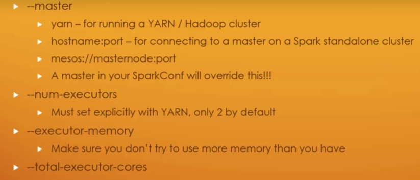

# Spark Coding Tutorial

This tutorial shows you how to code with Spark (Scala).

If you would like to see tutorial about Spark concepts, go to [Spark Note](https://github.com/lizhanmit/learning-notes/blob/master/spark-note/spark-note.md).

Environment:

- Spark 2.4.0
- Scala: 2.12.3
- IDE: Scala IDE Eclipse

Code Review Sequence:

1. rddBasics package
2. dataFrameBasics package
3. datasetBasics package
4. onClusterBasics package
5. onClusterBasics.operateMySQLWithSpark package
6. udfBasics package
7. sparkML package
8. udemy serial packages

---

## Spark Installation

### Modify log4j

1. Under `spark/conf` folder, copy log4j.properties.template file to log4j.properties.
2. Open log4j.properties, modify `log4j.rootCategory=INFO, console` to `log4j.rootCategory=ERROR, console`.

### Set Up Spark Projects in IDE

1. Download Scala IDE for Eclipse.
2. Create a Maven project.
3. Rename folder "java" to "scala" for both "main" and "test".
4. Right click the project -> "Configure" -> "Add Scala Nature" to add Scala library.
5. Add dependencies in pom.xml.

---

## Code in Spark Shell

```scala
// in spark shell

val intArray = Array(1,2,3)
val intRDD = sc.parallelize(intArray)
intRDD.first
intRDD.take(2)
intRDD.collect
intRDD.collect.foreach(println)
intRDD.partitions.size  // get number of partitions of intRDD


val intList = List(1,2,3,4)
val intListRDD = sc.parallelize(intList, 10)  // specify number of partitions as 10 instead of the default


val fileRDD = sc.textFile("/Users/zhanli/spark/README.md")
fileRDD.first
fileRDD.take(3)
fileRDD.take(3).foreach(println)


val data = Array(
     | "This is line one",
     | "This is line two",
     | "This is line three",
     | "This is the last line")
val dataRDD = sc.parallelize(data)
val filterRDD = dataRDD.filter(line => line.length > 15)
filterRDD.collect.foreach(println)
val mapRDD = dataRDD.map(line => line.split(" "))
mapRDD.collect  // return type: Array[Array[String]]
val flatMapRDD = dataRDD.flatMap(line => line.split(" "))
flatMapRDD.collect  // return type: Array[String]


val numArray = Array(1,1,2,2,3,3,4)
val numRDD = sc.parallelize(numArray)
val distinctElementsRDD = numRDD.distinct
distinctElementsRDD.collect
```

---

## Spark Core Coding

### RDD Coding

- Get keys of RDD: `<rdd_var>.keys`
- Get values of RDD: `<rdd_var>.values`
- Sort RDD by key: `<rdd_var>.sortByKey()`
  - Ascending is default.
  - Descending: `<rdd_var>.sortByKey(false)`
- Sort RDD: `<rdd_var>.sortBy(<sort_accordance>)`
  - E.g. according to the second element of tuple in descending: `<rdd_var>.sortBy(_._2, false)`
- Only do mapping for RDD values: `<rdd_var>.mapValues(<func>)`
  - E.g. add 1 for values only: `<rdd_var>.mapValues(_ + 1)`
- Join two RDDs with the same key: `<rdd_var1>.join(<rdd_var2>)`
  - E.g. `(k, v1).join(k, v2)` Then you will get `(k, (v1, v2))`.
- Create a new key for RDD: `<rdd_var>.keyBy(<func>)`
  - E.g. `<rdd_var>.keyBy(<tuple> => <tuple._1>)`

### DataFrame Coding

- `myDF.show()`
- `myDF.select("someFieldName")`
- `myDF.filter(myDF("someFieldName") > 200)`
- `myDF.groupBy(myDF("someFieldName")).mean()`
- `myDF.rdd().map(<mapperFunction>)`

UDF:

```scala
val myUDF = (x => <userDefinedFunction>)
val myNewDF = myDF.withColumn("newColumnName", myUDF('columnName'))
```

---

## `import spark.implicts._`

When to use:

- when creating a Dataset.
- when using `$<columnName>` to convert a string to a column.

---

## Scala Object VS Scala App

When coding in IDE, you will be choosing to create a Scala Object or a Scala App under a package.

- Scala Object
  - With main function.
  - You are able to specify input parameters when executing the program.

- Scala App
  - Extends `App`.
  - Without main function.

---

## Read CSV File as Dataset

When reading a CSV file as a Dataset with a case class, make sure headers of the CSV file matches fields of the case class. If they are not same, use code to modify the header after converting the CSV file to DataFrame, e.g. removing spaces and lowering case the first character, and then convert to Dataset.   

---

## Spark UDF

Steps:

1. Define a function.
2. Convert the function into a UDF.
3. Apply the UDF to DataFrame or Dataset.

---

## Coalesce VS Repartition

### Coalesce

- Coalesce is fast in certain situations because it minimizes data movement.
- No shuffle. Merge partitions on the same node into one partition.
- Coalesce changes the number of nodes by moving data from some partitions to existing partitions. This algorithm obviously **cannot increase** the number of partitions.
  - For example, `numbersDf.rdd.partitions.size` is 4. Even if you use `numbersDf.coalesce(6)`, it is still 4 rather than 6.
- Avoids a full data shuffle.

### Repartition

- Repartition can be used to either increase or decrease the number of partitions in a DataFrame.
- Does a full data shuffle.
- If there is only a little amount of data but the number of partitions is big, there will be many empty partitions.
- You should only repartition when the future number of partitions is greater than the current number of partitions or when you are looking to partition by a set of columns.
- If you are going to be filtering by a certain column ofter, it can be worth repartitioning based on that column. E.g. `df.repartition(col("<columnName>"))`, or `df.repartition(<numberOfPartitions>, col("<columnName>"))`.

### Real World Example

1. Suppose you have a data lake that contains 2 billion rows of data (1TB) split in 13,000 partitions.
2. You want to create a data puddle containing 2,000 rows of data for the purpose of development by random sampling of one millionth of the data lake.
3. Write the data puddle out to S3 for easy access.

```scala
val dataPuddle = dataLake.sample(true, 0.000001)
dataPuddle.write.parquet("s3a://my_bucket/puddle/")
```

4. Spark does not adjust the number of partitions, so the dataPuddle will also have 13,000 partitions, which means a lot of the partitions will be empty.
5. Not efficient to read or write thousands of empty text files to S3. Improve by repartitioning.

```scala
val dataPuddle = dataLake.sample(true, 0.000001)
val goodPuddle = dataPuddle.repartition(4)
goodPuddle.write.parquet("s3a://my_bucket/puddle/")
```

6. **Why choosing 4 partitions here?** 13,000 partitions / 1,000,000 = 1 partition. Then `number_of_partitions = number_of_cpus_in_cluster * 4` (2, 3 or 4).
7. **Why using repartition instead of coalesce here?** The data puddle is small. The repartition method returns equal sized text files, which are more efficient for downstream consumers.

- **When filtering large DataFrames into smaller ones, you should almost always repartition the data.**
- **If you are reducing the number of overall partitions, first try `coalesce`.**

---

## Running with `spark-submit`

1. Make sure there are no paths to your local file system used in your script as the file system might be HDFS or Amazon S3.
2. Package up your Scala project into a .jar file.
	- If the project has many dependencies, use sbt to package your project instead of IDE export. Then use `spark-submit <your_.jar_file>` to run **without other parameters**.
3. Use `spark-submit` to execute driver script in command line.

```
spark-submit \
--class <class_object_that_contains_your_main_function> \
--jars <paths_to_any_dependencies> \
--files <files_you_want_placed_alongside_your_application> \
<your_.jar_file> \
<main_function_args>
```

You may need to specify the following parameters when running on cluster and you need to tweak them.

- These parameters should be pre-configured on cluster or in Spark configuration file.



---

## Running on Cluster

Take Amazon EMR (Elastic MapReduce) as an example.

### Best Practice

- If executors start failing, you may need to adjust the memory each executor has from the master node. `spark-submit --executor-memory 1g <your .jar file>`
- If something timed out or heartbeat failed, it indicates your cluster is not big enough (hardware aspect) or you did not partition your job well.
	- (Try 1st) Use `partitionBy()` to demand less work from each executor by using smaller partitions.
	- (2nd) Each executor may need more memory.
	- (3rd) You may need more machines (capacity) in your cluster.
- Try to keep dependencies (packages) to a minimum.
	- If you only need to write several more lines of code, **DO NOT** import a new package.
	- Time is money on your cluster.

### Steps

1. Get your scripts and data someplace where EMR can access them easily.
	- AWS's S3 is a good choice. Use `s3n://<file_path>` when specifying file paths, and make sure your file permissions make them accessible.
2. Start Spark on AWS.
3. Get the external DNS name for the master node, and log into it using user account and private key file.
4. Copy driver program's .jar file and any other files it needs to the master node using `aws s3 cp s3://<bucket_name>/<file_name> ./`.
5. Run `spark-submit`.
6. Terminate your cluster when you are done.

---

## Tips

- **DO NOT** recommend using `toDF` on `Seq` type for production, because it does not play well with null types.
    - E.g. `val myDF = Seq(("Hello", 2, 1L)).toDF("col1", "col2", "col3")`.
- Spark’s TimestampType class supports only second-level precision. If you are going to be working with milliseconds, use `LongType`.
- Recommend parsing dates, timestamps and nulls explicitly instead of relying on implicit conversions.
- Show all rows of a DataFrame in the console instead of only 20 rows by default: `df.show(df.count())`.

### Null Values

- Use nulls to represent missing or empty data in DataFrames, because Spark can optimize working with null values more than it can if you use empty strings or other values.
- Use `asc_nulls_first`, `desc_nulls_first`, `asc_nulls_last`, or `desc_nulls_last` to specify where you would like your null values to appear in an ordered DataFrame.

Two things you can do with null values:

- explicitly drop nulls
- fill them with a value (globally or on a per-column basis)

---

### Optimization

- Sometimes it is advisable to sort within each partition using `sortWithinPartitions` before another set of transformations.
    - E.g. `spark.read.format("json").load("filePath").sortWithinPartitions("<columnName>")`.

---

## Troubleshooting

- **Problem 1**

When running "hello world" example once after setting up the project, got such an error.

```
Exception in thread "main" java.lang.ArrayIndexOutOfBoundsException: 10582
...
```

Solution: Add such a dependency in pom.xml.

```
<dependency>
	<groupId>com.thoughtworks.paranamer</groupId>
	<artifactId>paranamer</artifactId>
	<version>2.8</version>
</dependency>
```
